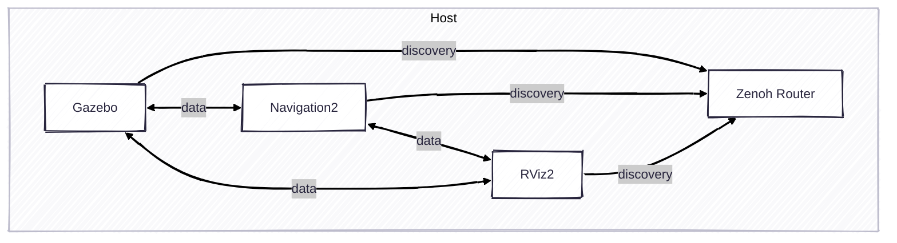

# Exercise 1 - Navigation2 with rmw_zenoh

The exercise shows the basic example how to run navigation2 with rmw_zenoh.



```bash
# Terminal 1: Run the Zenoh router
just router
# Terminal 2: Run the simulator
just rox_simu
# Terminal 3: Run the navigation
just rox_nav2
# Terminal 4: Run the rviz2
just rviz_nav2
```

The navigation2 is still working even we kill the Zenoh Router. Why?
Try to restart Zenoh router and rviz2. You can see that everything still works well.

---
[Next exercise ➡️](ex-2.md)
