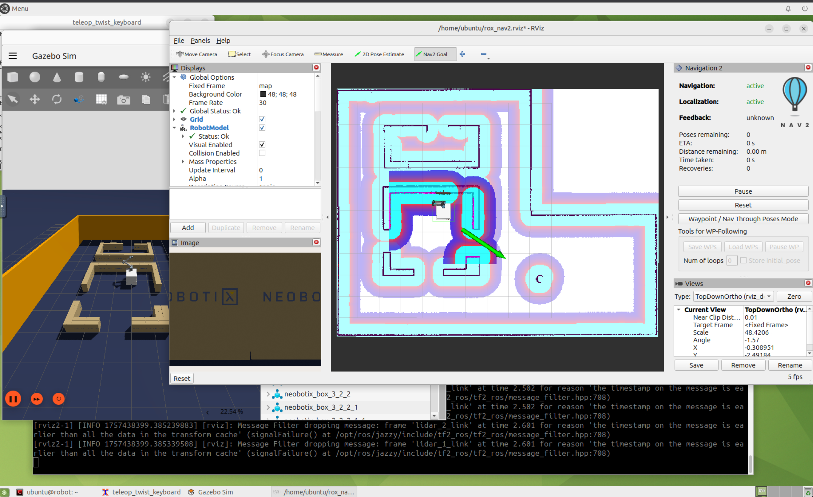

# Exercise 2 - A complete simulation with Nav2

In this exercise we will run a Neobotix ROX robot simulation in Gazebo, along with Navigation2 and RViz2.

From now on, all the commands are simplified with the help of `just` tool. It supports completion: in a terminal, type `just` and hit `tab` key twice to see the available commands.  
All the commands are defined in `~/justfile`.

## Run the simulation

In 2 distinct terminals:

1. Start the Zenoh router:  
   `just router`

2. Start the simulation:  
   `just rox_simu`

To run the simulation in headless mode (without Gazebo UI), you can run:
 `just rox_simu headless_simulation:=True`

## Run Navigation2 and RViz

In 2 distinct terminals:

1. Start Navigation2:  
   `just rox_nav2`

2. Start Rviz:  
   `just rviz_nav2`

Rviz is configured for Navigation2 and with subscriptions to the Realsense camera (image and points cloud).  
Once the costmap is shown, click on `Nav2 goal` and draw an arrow to set a navigation goal.

## Get some metrics

We prepared some commands to perform some measurement on this setup:

- `just top` : show the CPU usage with each process command line.
- `just iftop_lo` : show the traffic over the loopback interface (VNC excluded).
- `just rt_factor` : show the Gazebo real-time factor
- `just cam_latency` : subscribe to camera's point cloud or image topics and show average latency.  
   **WARNING**: you must run the simulation to use the wall time as such: `just rox_simu use_wall_time:=True`. However, with this mode Navigation2 is no longer working.

---
[Next exercise ➡️](ex-3.md)
