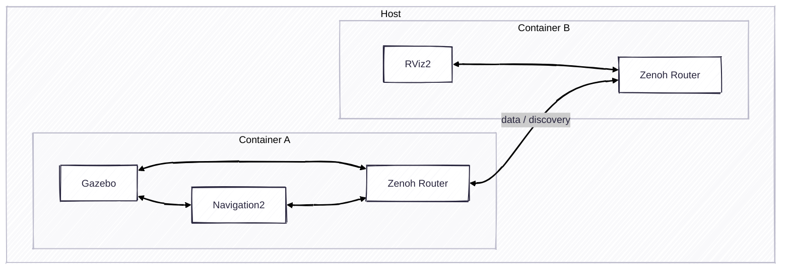

# Exercise 3 - Run rviz2 to visualize the remote robot

It's common to visualize the robot from other host. The exercise will guide you how to visualize your robot remotely.



* Container 1

```bash
# Terminal 1
just router
# Terminal 2
just rox_simu
# Terminal 3
just rox_nav2
```

* Container 2

```bash
# Terminal 1
just router
# Terminal 2
just rviz_nav2
```

You can stop the Zenoh Router and the rviz2 will stop working. That means the ROS messages need to pass through the Zenoh Router.

---
[Next exercise ➡️](ex-4.md)
