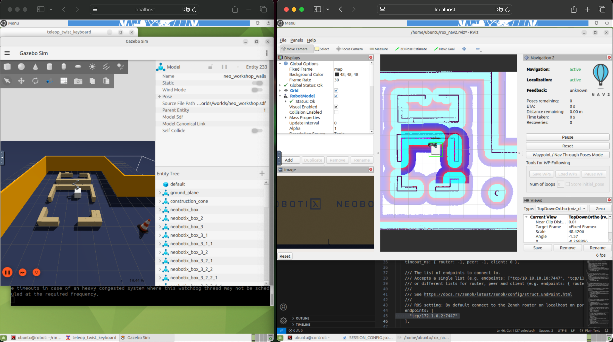

# Exercise 4 - Remote connectivity

It's common to visualize the robot from other host. The exercise will guide you how to visualize your robot remotely, from the control container.



## In robot container

Start the robot simulation and the Navigation2 stack.

1. Run the Zenoh router:  
   `just router`
2. Run the simulation:  
   `just rox_simu`
3. Run Navigation2:  
   `just rox_nav2`

With the current configuration, all the Nodes are communicating in peer-to-peer and with the router via TCP over the loopback or via shared memory for the big messages.  
The only way to communicate with the Nodes is to connect to the router which is listening for incoming TCP connections on all the available network interfaces and port **7447** (`tcp/[::]:7447`).

## In control container

### Solution 1: Run another router

The simplest solution to connect Nodes running in a remote host (here the controler container) to the robot's Nodes is to run another router which connects to the robot's router.

1. Copy the Zenoh Config to `~/container_data/`, just as we did in the robot container before. After the copy, remember to `source ~/workshop_env.bash` again to set the environement variables with those new files.

   ```bash
   cp ~/rmw_zenoh/install/rmw_zenoh_cpp/share/rmw_zenoh_cpp/config/DEFAULT_RMW_ZENOH_ROUTER_CONFIG.json5 \
      ~/container_data/ROUTER_CONFIG.json5
   cp ~/rmw_zenoh/install/rmw_zenoh_cpp/share/rmw_zenoh_cpp/config/DEFAULT_RMW_ZENOH_SESSION_CONFIG.json5 \
      ~/container_data/SESSION_CONFIG.json5
   source ~/workshop_env.bash
   ```

2. Modify `~/container_data/ROUTER_CONFIG.json5` to add `tcp/172.1.0.2:7447` as connect endpoint:

   ```json5
     // ...
     connect: {
       // ...
       endpoints: [
         "tcp/172.1.0.2:7447"
       ],
       // ...
     },
     // ...
   ```

3. Run the router:  
   `just router`
4. Run Rviz:  
   `just rviz_nav2`

The benefit of this solution is that you can have a full ROS system with several nodes communicating
peer-to-peer inside your remote host. The two routers are routing the required traffic between your two sub-systems, possibly batching some messages that could come from different Nodes.

However, if your remote host only runs one node, you might want to avoid an extra hop via a local router and prefer to have your node directly connecting to the robot's router.

### Soluton 2: RViz connecting directly to the robot's router

1. Modify `~/container_data/SESSION_CONFIG.json5` in container_data to set the mode to `client` and set `"tcp/172.1.0.2:7447"` as connect endpoint:

   ```json5
     mode: "client",
     // ...
     connect: {
       // ...
       endpoints: [
         "tcp/172.1.0.2:7447"
       ],
       // ...
     },
     // ...
   ```

2. Stop the router, stop Rviz and run it again:  
   `just rviz_nav2`

> [!Note]
>
> ***Why do we need to configure the mode to `client` ?***
>
> *By default the router is configured to assume that peers can connect directly to each other, for direct peer-to-peer communication. However the ROS nodes are configured to communicate only via the loopback. Thus a node in the controler host/container cannot connect to a node in the robot.*
>
> *In `client` node, the node always has only one connection to the router. The router knows it can't connect directly to another node and will always route the communication for this `client` node.*
>
> *The behavior of the router can be changed to also route the communication between peers that cannot directly connect to each other. For this, configure `routing/router/peers_failover_brokering=true`. Be aware that this setting introduces additional management overhead and extra messages during system startup, increasing with the number of nodes.*

## Bonus - shared memory between containers

Shared memory between Docker containers can be setup defining a common `tmpfs` type volume for all, mounted as `/dev/shm`. See how it's done the [docker-compose-common-shm.yaml](../docker-compose-common-shm.yaml) file.

You can experiment with this alternative setup of containers as such:

1. Verify that your `roscon2025_workshop/container_volumes/robot_container/SESSION_CONFIG.json5` still has shared memory enabled, following the exercise 3.  

2. On you host, run the containers:  
   `docker compose -f docker-compose-common-shm.yaml up`

3. On the robot container on http://localhost:7080/
   - Run the router:  
     `just router`
   - Run the simulation using wall time:  
     `just rox_simu use_wall_time:=True`

4. On the control container on http://localhost:7081/
   - Run the camera latency measure, configured as a client connecting to the robot's router and with shared memory enabled:  
     `ZENOH_CONFIG_OVERRIDE='mode="client";connect/endpoints=["tcp/172.2.0.2:7447"];transport/shared_memory/enabled=true' just cam_latency`
   - See the latency you get. To compare without shared memory, run:  
      `ZENOH_CONFIG_OVERRIDE='mode="client";connect/endpoints=["tcp/172.2.0.2:7447"];transport/shared_memory/enabled=false' just cam_latency`

5. When you are finished, just hit `CTRL+C` where you run `docker compose up` command. Then run `docker compose -f docker-compose-common-shm.yaml down`

---
[Solution](solutions/ex-4/) 💡

[Next exercise ➡️](ex-5.md)
