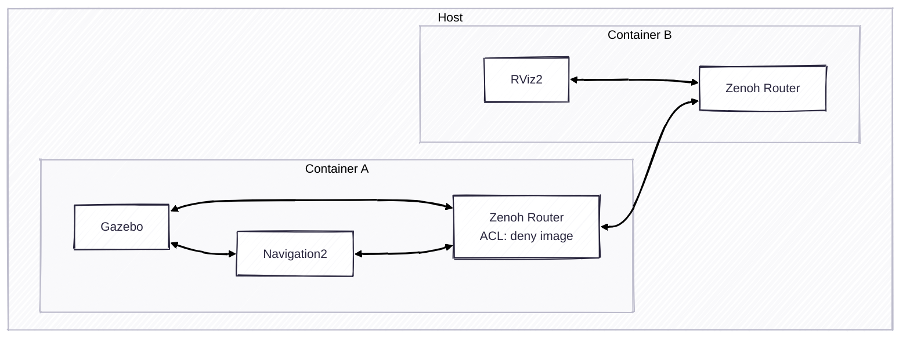

# Exercise 4 - Access Control

Sometimes we just don't want to expose all the topics to the network for both bandwidth and security issue. The Access Control in Zenoh can help us filter the traffic.

Uncomment the ACL configuration in the Zenoh Router config on the robot container. Then restart the Zenoh Router. We don't allow the image topic to pass through the Zenoh Router. You can see that the image on the Rviz will not be updated anymore.

---
[Next exercise ➡️](ex-5.md)
