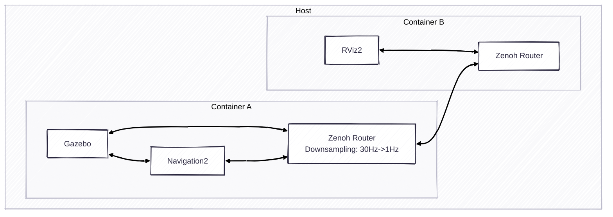

# Exercise 5 - Downsampling

If we want to monitor a topic and also want to reduce the traffic, downsampling the ROS messages is a good idea. Zenoh can achieve this easily.

Uncomment the downsampling configuration in the Zenoh Router config on the robot container. Then restart the Zenoh Router. We make the frequency of the camera image (The topic is `camera/image_raw`) drop to 1 Hz. You can see the image on the rviz is obviously lagging.

---
[Next exercise ➡️](ex-6.md)
