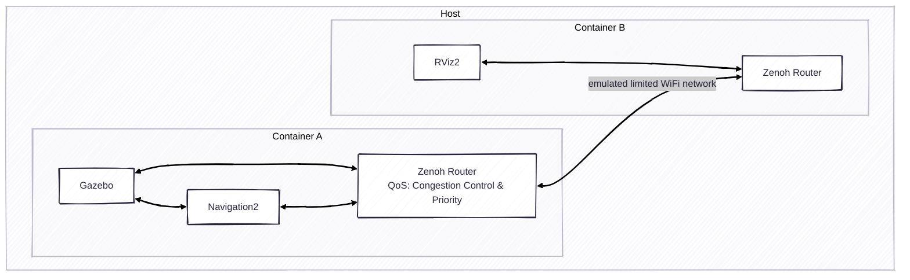

# Exercise 6 - Adjust the QoS & Priority of topics

Not every topic is important. Some might be large but less significant, while some is very critical. Zenoh supports adding the priority for each topic.



* Emulate the restrained network

```bash
just network_limit
```

* Camera image can't be loaded on the remote rviz2.

* Uncomment the QoS config in the router config and restart the Zenoh Router

* Although it's still lagging, we can see the camera image now.

* Restore the network

```bash
just network_normal
```

---
[Next exercise ➡️](ex-7.md)
