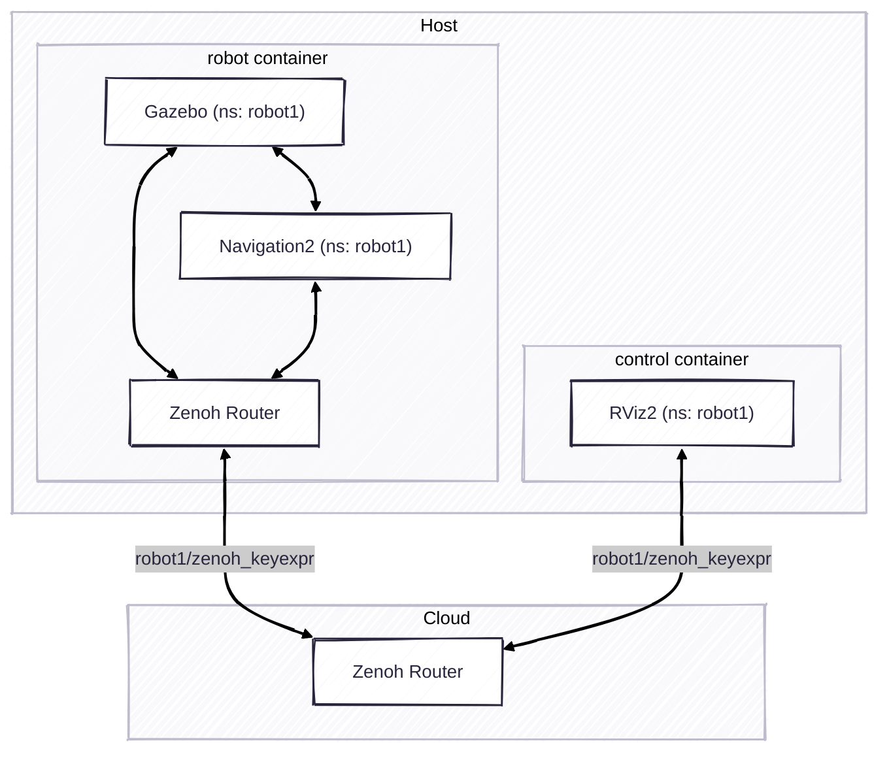

# Exercise 7 - Traverse the Internet

If both your robot and rviz are behind the NAT, it's difficult to connect them together. This is not an issue for Zenoh. We can easily add a Zenoh router to traverse the Internet.

However, here comes another issue: If we connect several robots to the same router, we will face a topic conflict among robots. In this case, we can assign Zenoh namespace for each robot to isolate the traffic.

> [!warning]
>
> Note that the Zenoh namespace is different from the one in ROS 2.
> That means they can't be used mixedly.
> They are in different chunk of the Zenoh key expression.
>
> ROS 2 namespace: `<domain_id>/<ros_namespace>/<topic>/<type>/<hash>`
> Zenoh namespace: `<zenoh_namespace>/<domain_id>/<topic>/<type>/<hash>`
>

## Add namespace for your robots

1. Stop all the simulation, robot, rviz first.
2. Choose an unique namespace for your robot.
3. Add `namespace: "your_robot_name"` to the namespace section in the `SESSION_CONFIG.json5` for both robot and control containers.

Note that Zenoh Router is only used for discovery and messages forwarding, so we need to add the `namespace` in the session configuration.

## Connect to an external Zenoh router

1. Get the IP of the external Zenoh router. (Assume the IP is `10.0.0.1`)
2. Add the connect endpoints to the `ROUTER_CONFIG.json5` on the **robot** container. (e.g. `"tcp/10.0.0.1:7447"` in `connect/endpoints`)
3. Update the connect endpoints in the `SESSION_CONFIG.json5` on the **control** container. (e.g. `"tcp/10.0.0.1:7447"` in `connect/endpoints`)
   * Note that the previous connect endpoint (the one connecting to the robot container) should be removed, since we want it to connect through the external router.
4. Run the simulation, robot and rviz. You can find them connecting together.
