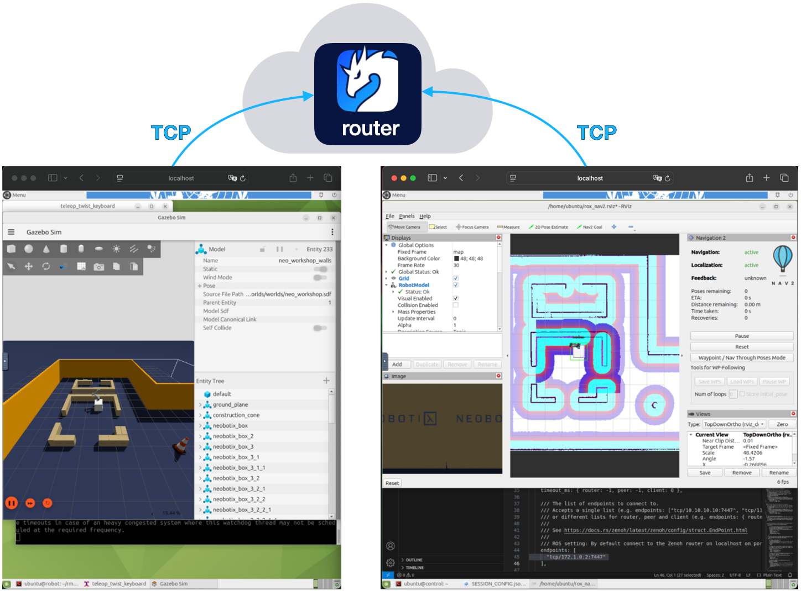

# Exercise 8 - Traverse the Internet

Remote control and monitoring of a robot over the Internet could be challenging because of networks configurations, NATs and firewalls. Fortunately, Zenoh provides a simple solution requiring only a connection to Internet from your hosts:

Use a Zenoh deployed on Internet (e.g. in a Cloud instance) as an intermediary. Both your robot and your controler connects to this router, via TCP, TLS or even QUIC.

For a simple test in this workshop, all the attendees will connect via TCP to the same router deployed on `roscon.zenoh.io`. However, since all the robots are using the same topics and services names, they will conflict with each other. We will now see the different solutions to overcome this issue.

## Use different ROS namespaces for each robot

This solution is cumbersome because it requires updating the launch files and remapping the `/tf` and `/tf_static` topics. However, for fleet management use cases - such as with Open-RMF - it’s the most suitable approach.

## Use different `ROS_DOMAIN_ID` for each robot

As the domain id is part of the key expressions used by `rmw_zenoh` the conflicts are avoided.
You can easily configure it in your environment with:  
`export ROS_DOMAIN_ID=123456`

> [!Note]
>
> `rmw_zenoh` has not the same [constraints](https://docs.ros.org/en/jazzy/Concepts/Intermediate/About-Domain-ID.html#id4) than DDS for the domain id. Any number up to `MAX_UINT` can be used.

## Configure a Zenoh namespace for each robot

A Zenoh namespace is transparently added as a prefix to the key expressions for all the messages sent by a Zenoh session. It's automatically stripped from all incoming messages, to preserve the transparency.  
To configure the namespace, edit the `~/container_data/SESSION_CONFIG.json5` files on both containers to add `namespace: "<your_namespace_name>`  

> [!Note]
>
> A Zenoh namespace is different than a ROS namespace. It won't appear in any ROS graph

Since the Zenoh key expressions will be prefixed by this namespace, the key expressions starting with `*/camera/` used in the router configuration for `downsampling` and `access_control` will no longer match the key expressions used by the nodes.  
In robot's container, edit the `~/container_data/ROUTER_CONFIG.json5` file to make all those key expressions to start with `**/camera/`.

## Connect to the Zenoh router in the Cloud

1. In robot container's `~/container_data/ROUTER_CONFIG.json5` file, modify the `connect/endpoints` list to only include `"tcp/roscon.zenoh.io:7447"`

2. In the control container's `~/container_data/SESSION_CONFIG.json5` file, modify the `connect/endpoints` list to only include `"tcp/roscon.zenoh.io:7447"`

3. In the robot container, run:

   * `just router`
   * `just rox_simu`
   * `just rox_nav2`

4. In the control container, run:  
   `just rviz_nav2`

---

> [!Tip]
>
> For a similar setup but secured via mTLS or QUIC you can rely on the [Zetta Platform](https://www.zettascale.cloud/). This Platform-as-a-Service offering allows you to provision Zenoh router instances in different Cloud regions and to automatically generate the certificates and keys for authentication and encrypted connections.  
> For more information and demonstrations watch [those videos](https://www.youtube.com/playlist?list=PLZDEtJusUvAaaBz6vwGyRDJnkYkMw8DfJ).
