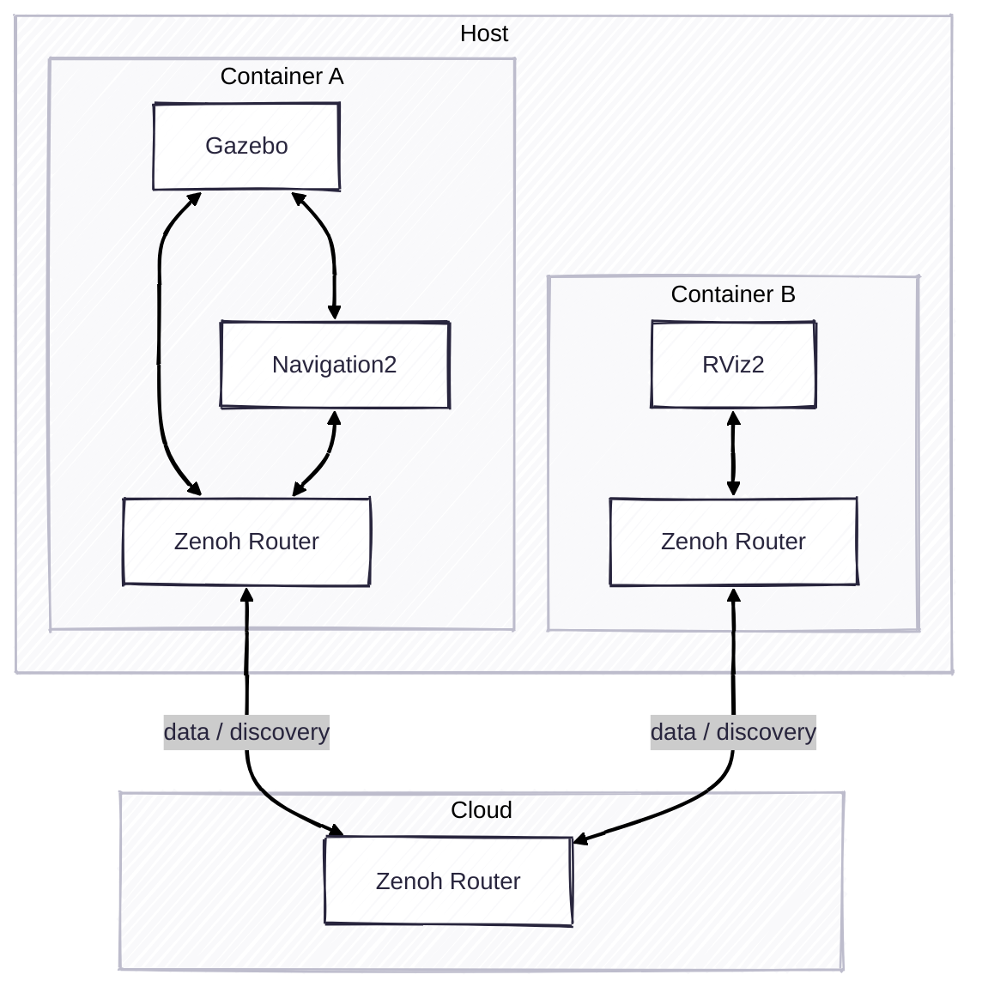

# Exercise 8 - Traverse the Internet

If both your robot and rviz are behind the NAT, it's difficult to connect them together. This is not an issue for Zenoh. We can easily add a Zenoh router to traverse the Internet.

